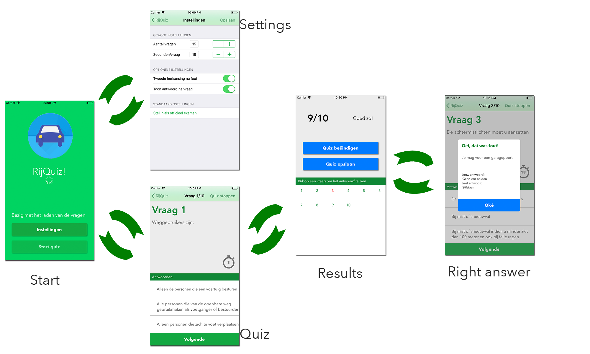

# RijQuiz

The RijQuiz app is an app in which a quiz gets presented about the driving regulations in Belgium. It uses questions fetched from a live server. Since the driving regulations in Belgium sometimes change, those questions can sometimes be updated and therefore it is necessary that the app updates its questionlist when needed to. The documentation about this live server can be found in the github repository [RijQuizBackend](https://github.com/KarelHeyndrickx/RijQuizBackend). 

## Users preferences

The user has a few preferences he can set before starting a quiz. This gives him more freedom in case of actual quizing and learning about the driving rules. An overview of those rules can be seen in the table underneath 

| Preference            | Explanation                                                  |
| --------------------- | ------------------------------------------------------------ |
| Amount of questions   | This allows the user to set how many questions he wants to get during the quiz. |
| Seconds per questions | Since it is a quiz, there is a timer involved. This setting indicates how many seconds a user has before submitting his answer |
| Show answer           | This setting allows the user to see the official answer right after he submitted his final answer and because of that the user can learn the driving regulations even faster |
| Redo                  | The redo setting allows the user to have a second attempt in case his submitted answer was wrong. |
| Real examination      | The real examination setting sets the above settings like if it were a real exam in Belgium |

## The flow 

 

The entirety of the app is embedded in a Navigation Controller. As seen in the picture above, when the app launches it displays the starting screen. This is the StartscreenController. While on this screen the app checks whether the questions that are currently saved on the users devices are up to date with the ones on the live server. If they aren't, the questions get updated. The user now as the option to either set his prefered settings as seen in the settings screen (which is the SettingsTableController) or to start the quiz. In the quiz screen (this is the QuestionscreenController) the user can play the quiz and depening on his preferences he will get a redo or correct answer popup after submitting his answer. Whenever the user is done playing or the quiz is finished he will be presented the ResultsViewController. In here the player gets an overall view of his performance and can click on a questions to see the correct answer of it. The user can also choose to save the current quiz in case he wasn't finished. 

## Project hierarchy

All the code of this project can be found in `RijQuiz/` when located in the main directory. This foulder has a fewsubfolders grouping certain functionality

| Folder           | Functionality                                                |
| ---------------- | ------------------------------------------------------------ |
| Assets           | This folder contains the images used in this app.            |
| Components       | This folder contains all the custom UI elements.             |
| Extensions       | The extensions folder contains functionality to extend certain Types. |
| Models           | The models folder contains all the business logic. What is a quiz, what is a question, what does it have for properties. All of this is coded in the models package |
| View Controllers | The view controller folder contains all the view controllers used to handle the users interactions and the algorithms. |

## Author & license

This project belongs to Karel Heyndrickx - 3rd year student Applied Informatics - Programming at Hogeschool Gent